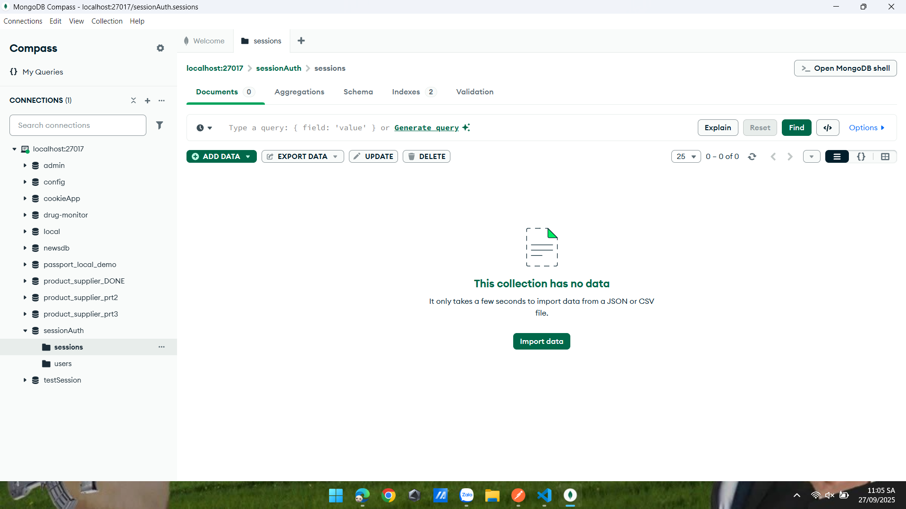

lab_06_cookie_session_auth

README này hướng dẫn chi tiết cách chạy và kiểm thử project demo xác thực sử dụng cookie + session (express-session + connect-mongo).

Các file chính:

- `app.js` — cấu hình Express, kết nối MongoDB, cấu hình session và routes
- `routes/auth.js` — các route: register, login, profile, logout
- `models/User.js` — Mongoose model cho User (hash password bằng bcryptjs)
- `img/` — ảnh minh họa các bước test (image1.png → image9.png)

---

## Yêu cầu

- Node.js (>=16)
- npm
- MongoDB chạy tại `mongodb://127.0.0.1:27017` (mặc định project kết nối tới DB `sessionAuth`)

## Cài đặt & chạy

1. Mở PowerShell và chuyển vào thư mục `cookie_session_auth`:

```powershell
cd lab_06_cookie_session_auth/cookie_session_auth
```

2. Cài dependency (nếu chưa cài):

```powershell
npm install
```

3. Chạy ứng dụng:

```powershell
node app.js
```

Bạn sẽ thấy log: `Server running on http://localhost:3000` (và thông báo kết nối MongoDB).

Ảnh minh họa khi server khởi động:


---

## API endpoints

Base path: `/auth`

- POST `/auth/register` — body JSON: `{ "username": "<username>", "password": "<password>" }` — tạo user mới (mật khẩu được hash)
- POST `/auth/login` — body JSON: `{ "username": "<username>", "password": "<password>" }` — đăng nhập và tạo session; server sẽ trả cookie `connect.sid`
- GET `/auth/profile` — route bảo vệ: chỉ truy cập khi có session hợp lệ
- GET `/auth/logout` — hủy session và xóa cookie

---

## Bước-by-step test (kèm ảnh)

Hướng dẫn dưới đây dùng `curl` trong PowerShell. Bạn có thể dùng Postman/Insomnia nếu thích.

### Bước 1 — Chạy server

Chạy `node app.js` và kiểm tra log.

Ảnh: server start


### Bước 2 — Test Register (POST)

Endpoint: `POST /auth/register`

Ví dụ (PowerShell):

```powershell
curl -X POST http://localhost:3000/auth/register -H "Content-Type: application/json" -d '{"username":"alice","password":"pass123"}'
```

Ảnh minh họa quá trình gửi request và response (nhiều ảnh thể hiện các bước/kiểm tra khác nhau):




### Bước 3 — Login (POST)

Endpoint: `POST /auth/login`

Ví dụ (lưu cookie vào file để dùng cho các request tiếp theo):

```powershell
curl -c cookies.txt -X POST http://localhost:3000/auth/login -H "Content-Type: application/json" -d '{"username":"alice","password":"pass123"}'
```

Ảnh minh họa login thành công / cookie được tạo:


### Bước 4 — Truy cập profile (GET)

Endpoint: `GET /auth/profile` — yêu cầu có session cookie.

Ví dụ:

```powershell
curl -b cookies.txt http://localhost:3000/auth/profile
```

Ảnh minh họa trả về profile (thông tin user, không bao gồm password):


### Bước cuối — Logout (GET)

Endpoint: `GET /auth/logout` — hủy session và xóa cookie.

Ví dụ:

```powershell
curl -b cookies.txt http://localhost:3000/auth/logout
```

Ảnh minh họa logout và xác nhận:


---

## Lưu ý bảo mật / cấu hình

- Kết nối MongoDB và session secret hiện đang được cấu hình cứng trong `app.js`:
	- MongoDB URL: `mongodb://127.0.0.1:27017/sessionAuth`
	- Session secret: `mysecretkey`
- Trong môi trường production, hãy chuyển các giá trị này sang biến môi trường (ví dụ dùng `dotenv`).
- Hiện `cookie.secure` được đặt `false` để tiện phát triển trên HTTP; chuyển sang `true` khi dùng HTTPS.
- Sử dụng store session bền vững (ví dụ `connect-mongo`) — project này đã dùng `connect-mongo` để lưu session vào MongoDB.

## Cải tiến đề xuất

- Thêm `dotenv` và `.env.example` để quản lý cấu hình.
- Thêm xác thực đầu vào (validation) và rate-limiting cho các route auth.
- Thêm test tự động (script hoặc test tích hợp) kiểm tra flow register → login → profile → logout.

